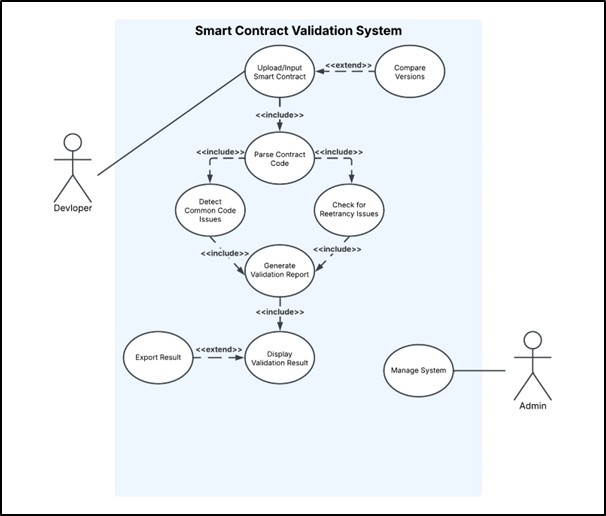
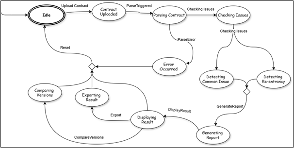

# Smart Contract Validation System

A simple and powerful formal verification project built to help smart contract developers catch bugs *before* deploying. This system checks for vulnerabilities like re-entrancy, dead code, access control issues, and more, using formal methods such as Z Notation, Predicate Logic, and FSM modeling.

---

## 🚀 Project Highlights

- Upload & validate Solidity smart contracts
- Detect issues like:
  - Dead code
  - Overflow/Underflow
  - Re-entrancy
  - Access control flaws
- View detailed validation reports
- Compare different contract versions
- Formal verification using:
  - Z Notation
  - Predicate Logic
  - Temporal Logic
  - Finite State Machines (FSM)

---

## 📂 Folder Structure

```
/docs
├── Requirements.md          # Functional & Non-functional requirements
├── Predicate_Logic.md       # Predicates & logic rules
├── Temporal_Logic.md        # Temporal safety/liveness properties
├── Z_Notation.md            # Formal Z specs
├── Test_Cases.md            # FSM-based test scenarios
├── Use_Case.png             # Use case diagram
├── State_Machine_Diagram.png# FSM diagram
```

---

## 🔍 Formal Method Docs

This project uses **Z Language** to write formal system specifications. It defines the contract validation logic, system states, and operations precisely using schemas, sets, functions, and predicates. The Z specs are written and tested using [Z-Editor](https://z-editor.github.io/) for clean formatting and validation.

- **[Requirements](docs/Requirements.md)** — Clear list of what the system should do (FRs + NFRs).
- **[Z Notation](docs/Z_Notation.md)** — Formal specs for core operations.
- **[Predicate Logic](docs/Predicate_Logic.md)** — Logic statements behind validation.
- **[Temporal Logic](docs/Temporal_Logic.md)** — Describes behavior over time.
- **[Test Cases](docs/Test_Cases.md)** — Valid/invalid sequences based on FSM.

---

## 🧪 Example Use Case

1. A developer uploads a smart contract.
2. The system parses the contract.
3. Vulnerabilities are detected and listed.
4. A validation report is generated.
5. The user can export the report or compare it with a newer version.

---

## 📸 Diagrams

| Use Case | FSM |
|----------|-----|
|  |  |

---

## 🛠️ Tech Stack

- Markdown for docs
- Z Notation written using [Z-Editor](https://z-editor.github.io/)
- Diagrams via draw.io or similar
- GitHub for version control

---

## 💡 Tip for Developers
Formal methods might sound intimidating, but they’re super useful when it comes to critical code like smart contracts. This repo is a good starting point if you’re curious about modeling systems precisely.

---

## 📬 Feedback?
Feel free to open an issue or suggest improvements!

---

> "Don’t just test your code. **Prove it’s correct.**"
