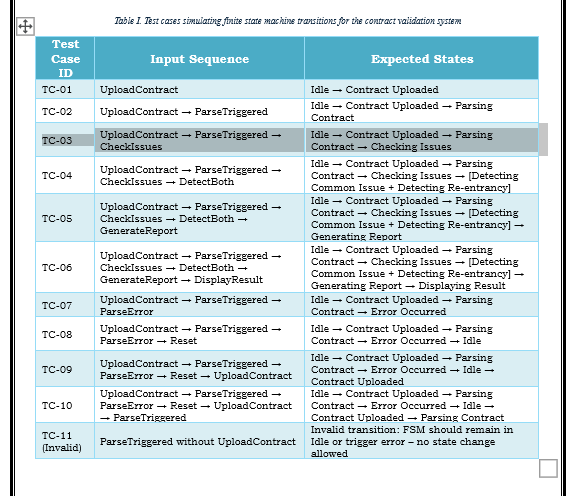

# Functional and Non-Functional Requirements

## a. Functional Requirements

- **FR-1**: The system shall allow the users to upload or input their smart contract source file/code.  
- **FR-2**: The system shall parse the uploaded smart contract code into a readable internal structure.  
- **FR-3**: The framework shall detect common code issues such as unreachable code, math errors (e.g., overflows), and improper access control.  
- **FR-4**: The system shall check for re-entrancy problems.  
- **FR-5**: The system shall generate a detailed validation report with error messages and suggestions for fixes.  
- **FR-6**: The system shall let users export the results in a file.  
- **FR-7**: The system shall display validation results and errors clearly on the interface.  
- **FR-8**: The system shall allow uploading different versions of a smart contract to compare changes.  

---

## b. Non-Functional Requirements

### Performance & Efficiency
- **NFR-1**: The smart contract must execute within 3 seconds under normal network conditions.

### Security
- **NFR-2**: The contract must implement safeguards against re-entrancy attacks.  
- **NFR-3**: Only authorized addresses can call admin-level functions using role-based access control.

### Reliability & Fault Tolerance
- **NFR-4**: The contract must revert transactions gracefully when input validations fail.  
- **NFR-5**: The contract must implement a fallback and receive function to handle unexpected calls securely.  
- **NFR-6**: Smart contract functions should be modular to support easier auditing and upgrades.  
- **NFR-7**: The source code must be clearly commented, and a full specification should be documented.

### Testability
- **NFR-8**: Unit tests must cover at least 90% of the contract codebase.  
- **NFR-9**: The contract should be deployable on test nets for integration testing.

### Scalability
- **NFR-10**: The contract should support a high number of transactions per second without performance degradation.

### Usability
- **NFR-11**: Error messages must be clear and informative to end users interacting via a frontend.

